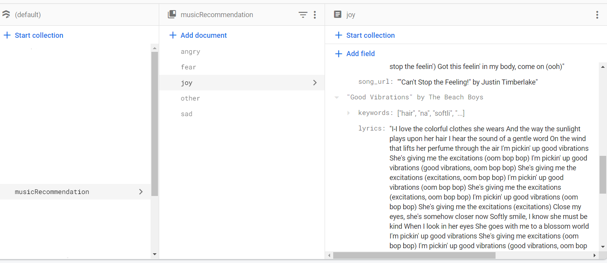

# Music Recommendation based on lyrics

# Curriculum

## [Quest Curriculum](https://quest.codingmind.com/view/E5647F93E0344AE18B06F42419)

**Note :**

- **This is for instructors to prepare ONLY**

- **Don't show the curriculum to students**

- **Do not lead the class by simply following the curriculum**

- **Who to contact for technical support: Marisabel**

## Create Database and Train text emotion model

To create the database and train text emotion model you will use the
provided [Google Colab](https://drive.google.com/file/d/1Vf0QrVbycC0aYUxyNWDyRSkExlWfdL6M/view?usp=sharing) as a
reference

### Prepare List of songs

- Search the song in YouTube for different emotion (angry, sad, joy, fear, other)
    - Download the song
        - https://en.y2mate.is/v2PXc/

### Vocal separation

- Librosa - Quest Curriculum
- Remove the voice from the audio

### Database - Songs

- Database

    - Firebase (Firestore and Storage) - Quest Curriculum
    - Upload songs to Firebase - Storage
        - Remove the voice to the song and upload it to the database
    - Add manually the lyrics of each song to the Firestore

- Introduction to NLP - Quest Curriculum. You only need to cover the introduction to NLP
- Analyze Lyrics
    - get_actions
    - get_keywords
        - References:
            - https://towardsdatascience.com/keyword-extraction-process-in-python-with-natural-language-processing-nlp-d769a9069d5c
    - get_stem
    - get_keywords_from_lyrics
      -Add keywords to each song in the database

sample image of how the Firebase would look like

### Train Text Emotion Model

- Introduction to Machine Learning - Quest Curriculum
- Download Dataset
    - https://www.kaggle.com/datasets/praveengovi/emotions-dataset-for-nlp
- Read Data
- Process and Clean Data
- Train Model
- Save Model

## Server

For the server you must use the IDE

- Flask - Quest Curriculum
- Create all the files that is in the repo. All these files contain the code that is in the Google colab except for the
  server.py
- Setup server
    - https://github.com/cm-st-project/music_based_on_lyrics/blob/main/server.py

